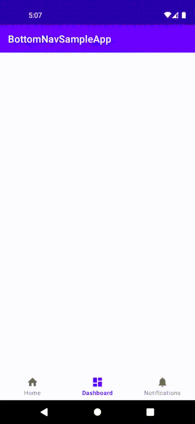

# Activity-based navigation using `BottomNavigationView`

A sample application demonstrating activity-based navigation using
bottom navigation.

## Medium article

[Activity-Based Bottom Navigation Using Shared Element Transition with BottomNavigationView](https://kelvinwatson.medium.com/bottomnavigationview-for-activity-based-app-navigation-using-shared-element-transition-c4de864d400f)

## Demo

